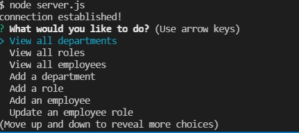

# Employee Tracker

This is a command line Employee Tracker. 

## Installation:

Creating the Repository, Clone it.

Node.js is required to run.

npm install to install the required npm package.

Sql2 installation

## Functionality:

Create a command line Employee Tracker focused on a role of database, connection and how to design database architecture, define Primary and Secondary keys and how to have connected these tables to each other’s.
Scheme and Seeds files were coded based on our database design model which was shown in the demo. 
 Also installing npm and MySQL2 is important because we need to have them.
To start using the application use MySQL and setup database using Seeds.sql 
The application is invoked by running node server.js in the command line.

## Features:

*JavaScript

*Node.js

*MySQL

*npm packages (Inquirer, mysql)

## Video:

## Screenshot:

 

